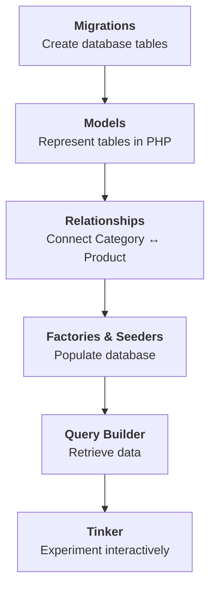

# **Laravel Framework Lab - Coffee Shop**

## **Sections**
### **Section 1 - Working with Database**
**Ideas:**
|Concept | Description |
| :--- | :--- |
| Relationship | connection betwen models/table |
| `hasMany()` | one category has many products |
| `belongsTo()` | one product belongs to one category | 
| Factory | recipe for generating model data |
| Seeder | inserts predefined/sample data |
| Query Builder | builds database queries using PHP |
| Tinker | interactive Laravel/PHP REPL |

**Section 1 flow:**

