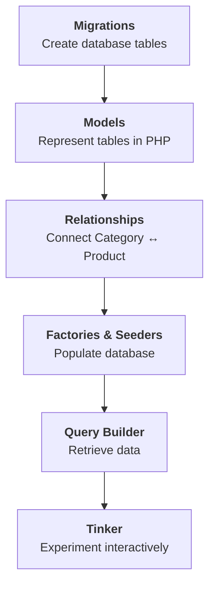
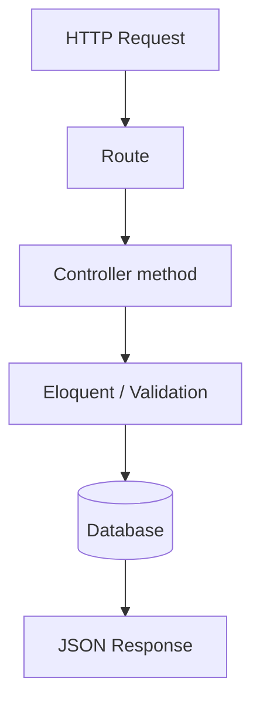

# **Laravel Framework Lab - Coffee Shop**

## **NOTES**
### **Run Application**
```shell
php artisan serve
```

### **Automatically Fix Formattings with PINT**
```shell
.\vendor\bin\pint --test
.\vendor\bin\pint
```

### **For *Herd* Users**
```bash
Microsoft Windows [Version 10.0.26200.9457]
(c) Microsoft Corporation. All rights reserved.

C:\Windows\System32>netstat -ano | findstr :80
  TCP    0.0.0.0:80             0.0.0.0:0              LISTENING       4
  TCP    [::]:80                [::]:0                 LISTENING       4

C:\Windows\System32>net stop http
The following services are dependent on the HTTP Service service.
Stopping the HTTP Service service will also stop these services.

   World Wide Web Publishing Service
   SSDP Discovery
   Print Spooler

Do you want to continue this operation? (Y/N) [N]: Y
The World Wide Web Publishing Service service is stopping.
The World Wide Web Publishing Service service was stopped successfully.

The SSDP Discovery service is stopping.
The SSDP Discovery service was stopped successfully.

The Print Spooler service is stopping.
The Print Spooler service was stopped successfully.

The HTTP Service service is stopping........
The HTTP Service service could not be stopped.


C:\Windows\System32>netstat -ano | findstr :80
```

## **Sections**
### **Section 1 - Working with Database**
**Ideas:**
|Concept | Description |
| :--- | :--- |
| Relationship | connection betwen models/table |
| `hasMany()` | one category has many products |
| `belongsTo()` | one product belongs to one category | 
| Factory | recipe for generating model data |
| Seeder | inserts predefined/sample data |
| Query Builder | builds database queries using PHP |
| Tinker | interactive Laravel/PHP REPL |


**Section 1 flow:**

```mermaid
flowchart TD
    A["<b>Migrations</b><br/>Create database tables"] --> B["<b>Models</b><br/>Represent tables in PHP"]
    B --> C["<b>Relationships</b><br/>Connect Category ↔ Product"]
    C --> D["<b>Factories & Seeders</b><br/>Populate database"]
    D --> E["<b>Query Builder</b><br/>Retrieve data"]
    E --> F["<b>Tinker</b><br/>Experiment interactively"]
```

## **Section 2 - Build a REST API**
**Workflow**

```mermaid
flowchart TD
    A["HTTP Request"] --> B["Route"]
    B --> C["Controller method"]
    C --> D["Eloquent / Validation"]
    D --> E[("Database")]
    E --> F["JSON Response"]
```